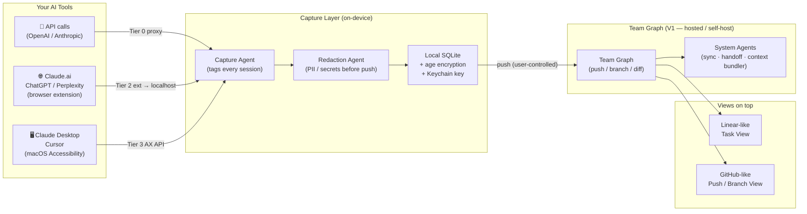
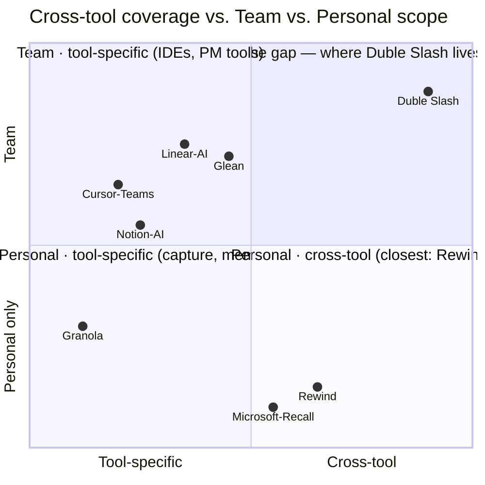
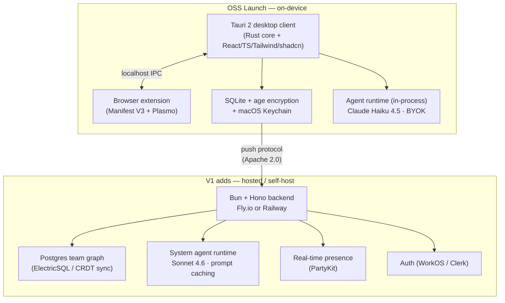
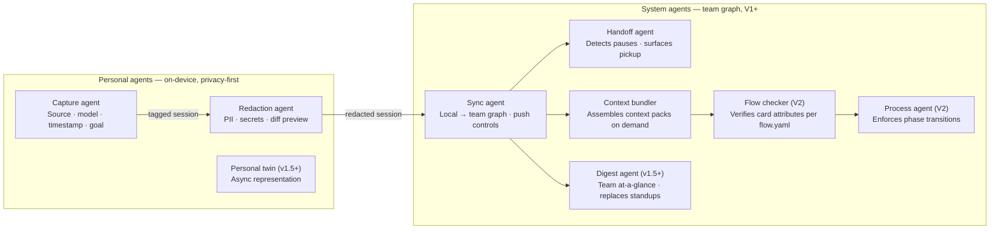
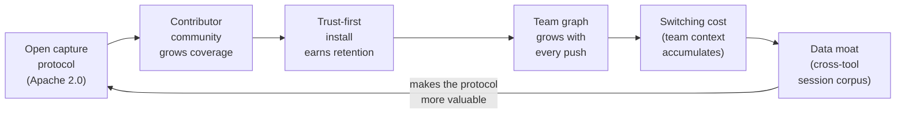

<!-- SLIDE 1 — TITLE -->

# Duble//Slash

### The AI cloud for AI projects

<br>

**Keep doing what you do best, where you do it best. We'll consolidate the rest.**

<br>

<span class="muted">A capture layer + the FISH method + a 13-agent fabric — across every tool, every model, every teammate.</span>

<br>

**Tal + Shenhav** · April 2026

<!-- LOGO: Duble//Slash wordmark · 200x48 · swap in _bmad/assets/logos/duble-slash-wordmark-white.svg -->

---

<!-- SLIDE 2 — THE PATTERN -->

## We've watched this pattern twice

*A shared thesis, built from living two platform shifts end to end.*

<br>

<div class="columns">

<div>

**SaaS revolution (2010–2018)**

Tools mushroomed. Every job-to-be-done got its own product. Teams ran 15 SaaS apps and nobody could see the whole picture.

**What happened:** the layer beneath them — the one that carried context *between* tools — became the most valuable real estate.

</div>

<div>

**AI revolution (2022–2026)**

The same pattern. Again. Faster.

Tools multiplied: Claude, ChatGPT, Cursor, Copilot, Perplexity, Figma AI, v0, Replit, Notion AI — and counting.

**What's coming:** the same consolidation. The layer beneath wins. Again.

</div>

</div>

<br>

> *"Let people shine wherever they already shine."* — the thesis that drives Duble Slash.

---

<!-- SLIDE 3 — INTRODUCING DUBLE SLASH -->

## Introducing Duble//Slash

*The AI cloud for AI projects. One install. Every tool. The FISH method underneath.*

<br>

**One paragraph:** For product designers, design leads, and PMs working with AI across multiple tools, **Duble//Slash is the AI cloud for AI projects.** You keep working where you work best — Claude Desktop, Cursor, ChatGPT Desktop, Terminal, Perplexity — and our agents quietly consolidate your **process, progress, and results** into one streamlined flow based on **FISH**, our double-diamond method for human–AI work.

<br>

**Three things layered, one install:**
1. A **capture layer** — tool-agnostic, model-agnostic, privacy-first — under everything you already do.
2. **FISH** — a four-phase, four-archetype method the AI can read and enforce so it stops drifting on you.
3. A **13-agent fabric** — four `//`-invoked specialists in your AI tool + nine background workers in the Context Cloud (V1+).

<br>

**The metaphor:** a cloud that enfolds every AI tool. Sign in once; your raw sessions stay on your machine; your shared project state syncs and gets a face — a Linear-style task view and a GitHub-style push-history view. Familiar shapes, applied to AI work.

<br>

**North-star feel:** *"Oh — the AI is finally working the way I was trained to work, I can see every step, and I can already picture my teammate picking this up."*

<!-- LOGO: Duble//Slash wordmark · 160x36 · swap in _bmad/assets/logos/duble-slash-wordmark-white.svg -->

---

<!-- SLIDE 3.5 — FISH: THE METHOD -->

## FISH — the method underneath

*A double-diamond for human–AI work. The moat.*

<br>

<div class="columns">

<div>

**Two axes → four archetypes. Every unit of work carries a sigil.**

```
                          KNOWN
                            ▲
               Tuna         │         Nemo
         (known × big)      │    (known × small)
   ──── BIGGER ─────────────┼──────────── SMALLER ──▶
              Willy        │        Salmon
         (unknown × big)    │   (unknown × small)
                            ▼
                        UNKNOWN
```

`sigil: { certainty: known|unknown, size: smaller|bigger }` — certainty decided first (size estimates are unreliable in unknown space). Drives how much ritual each phase gets. A Nemo's Explore is a 10-min heuristic scan; a Willy's is interviews + premortem + RFC prep.

</div>

<div>

**Four phases — fish anatomy.**

| # | Anatomy | Phase | Goal |
|---|---|---|---|
| 1 | Head | **Explore** | Open the aperture. Refuse to commit. |
| 2 | Left body | **Solidify** | Reduce unknowns to one shape. Lock the brief. |
| 3 | Right body | **Build** | Execute against the locked shape. |
| 4 | Tail | **Ship** | Release, narrate, capture learnings. |

Left + right body = the two diamonds of the **Double Diamond**. Head = pre-diamond research; tail = post-release loop.

**Every phase exit emits a `<FISH-handoff>`** — a short, machine-readable receipt the next agent / teammate / future-you reads to pick up cold.

</div>

</div>

<br>

<span class="muted">Lineage: Bánáthy's divergence–convergence + UK Design Council's Double Diamond + Tal's Fish Model (2024). FISH is the agent-operable evolution — same lineage, newly legible to LLMs.</span>

---

<!-- SLIDE 3.6 — WHY FISH (FAILURE MODES) -->

## Why FISH — the four ways AI work fails today

*Every designer using Claude / Cursor / ChatGPT / Figma AI has hit all four this quarter.*

<br>

| Failure mode | What it looks like | What FISH does |
|---|---|---|
| **Phase drift** | You ask "what should I consider?" and five prompts later you have wireframes and no research. The AI silently jumped Explore → Build. | Explorer **refuses** Solidify-shaped requests. Names the phase the request belongs to and offers a handoff. |
| **Intensity mismatch** | A one-hour tooltip change becomes a six-page research doc with personas and journey maps. The AI's default is "comprehensive." | The archetype × phase matrix tells the agent what *right-sized* looks like. No thesis for a Nemo, no napkin for a Willy. |
| **Context amnesia** | You explored a feature with Claude yesterday. Today you re-paste 30 messages, or you start over. (You usually start over.) | `<FISH-handoff>` *is* the thread. Sigil + locked + open + artifacts in one short block. Paste; resume. No re-briefing. |
| **Trust opacity** | "A quick polish pass" rewrote three microcopy strings, added a feature flag, and proposed a new IA. You caught two of those. Did you catch all three? | Every release emits a **trust receipt** — what shipped, what was redacted, who approved it. Reviewable by you and (V1) your teammate. |

<br>

**The bet:** *methodology is distribution.* The reason a designer installs Duble//Slash is not "it captures my sessions" — it's *"it makes the AI I already use finally work the way I was trained to work."*

---

<!-- SLIDE 4 — HOW IT WORKS — DIAGRAM -->

## How it works

*Three capture paths. One local store. One team graph.*

<br>



<br>

<span class="muted">Data never leaves the device without an explicit user push. Push is always local → team graph, never local → vendor.</span>

---

<!-- SLIDE 5 — THE THREE CAPTURE TIERS -->

## The three capture tiers

*Deepening coverage. Escalating only where users opt in.*

<br>

<div class="columns-3">

<div class="card">

### Tier 0
**API-key proxy**

User provides their own OpenAI / Anthropic key. Duble Slash runs a local proxy that forwards every call and records it.

**Coverage:** any tool that calls the OpenAI / Anthropic API — scripts, agents, custom tools.

**Risk:** zero. User owns the key. Explicitly authorized.

**Ships:** OSS launch.

</div>

<div class="card">

### Tier 2
**Browser extension**

Manifest V3 extension captures sessions on claude.ai, chatgpt.com, perplexity.ai via DOM + fetch interception.

**Coverage:** the three most-used web LLM surfaces.

**Risk:** very low. Well-precedented (same mechanism as Grammarly, ReadWise).

**Ships:** OSS launch.

</div>

<div class="card">

### Tier 3
**macOS Accessibility**

Reads Claude Desktop and Cursor's content via the macOS Accessibility API — platform-legitimate, user-granted.

**Coverage:** the two highest-value desktop AI apps.

**Risk:** low. User explicitly grants permission in System Settings.

**Ships:** OSS launch (or v0.2 if <80% at week 4).

</div>

</div>

<br>

<span class="muted">Network-layer TLS interception (advanced / power-user, opt-in only) and OS screen capture (never, or v2 at earliest) are explicitly out of scope for V1.</span>

---

<!-- SLIDE 6 — THE 13 AGENTS -->

## The agent fabric — thirteen, named, layered

*Four `//`-invoked specialists. Nine background workers. One shared vocabulary (FISH).*

<br>

<div class="columns">

<div>

### Local agents · `//`-invoked · OSS launch

Specialist personas your AI tool *adopts* when you type `//`. Each carries a deep method catalog.

| # | Agent · call-sign | Phase | One-liner |
|---|---|---|---|
| L1 | **Explorer** · *Nova* | head | The researcher. ~25 discovery methods. |
| L2 | **Solidifier** · *Sol* | left body | The shaper. Brief, AC, tradeoff axes, ADR. |
| L3 | **Builder** · *Bram* | right body | The builder. Contract, slice plan, tests, UV. |
| L4 | **Shipper** · *Sage* | tail | The shipper. Trust receipt, changelog, retro. |

Switching persona = switching method toolbox. Explicit `<FISH-handoff>` between.

</div>

<div>

### System agents · background · staged ship

Methodology orchestrators — not plumbing. Apply FISH at project scope.

| # | Agent · call-sign | Scope | Ships |
|---|---|---|---|
| S1 | **Capture** · *Tally* | personal | OSS |
| S2 | **Redaction** · *Cipher* | personal | OSS |
| S3 | **Sync** · *Relay* | personal→team | V1 |
| S4 | **Handoff** · *Beacon* | team | V1 |
| S5 | **Context Bundler** · *Pack* | team | V1 |
| S6 | **Digest** · *Echo* | team | V1.5 |
| S7 | **Personal Twin** · *Twin* | personal | V1.5 |
| S8 | **Flow Checker** · *Gate* | team | V2 |
| S9 | **Process** · *Loom* | team | V2 |

</div>

</div>

<br>

**Three rules every agent obeys: transparent, narratable, overridable.** The agent's phase, sigil-read, and reasoning are visible in the chat. When it changes phase, it says so. The human can veto any handoff. *Glass kitchen, not black box.*

---

<!-- SLIDE 6.5 — THE // GESTURE + @EXPERTS -->

## One gesture. Inside every tool.

*`//` switches the AI's persona. `@handle` loans in a specialist for a single turn.*

<br>

<div class="columns">

<div>

### `//` — phase invocation

Type inside Claude Desktop, Cursor, ChatGPT Desktop, Terminal, Perplexity:

```
//explore onboarding redesign — self-serve signup
  → Nova confirms sigil (unknown × bigger → Willy)
  → Runs Willy-intensity Explore
  → Refuses to wireframe
  → Emits <FISH-handoff to: solidifier>

//solidify <paste handoff>
  → Sol picks up with full sigil + locked + open
  → Reduces opens 8 → 2; emits handoff to builder

//build <paste handoff>     →  Bram (no re-debate)
//ship  <paste handoff>     →  Sage (trust receipt)
```

**Same designer, same AI tools, same problem. Six text blocks and a refusal posture.** That's the moat.

</div>

<div>

### `@handle` — expert shortcuts

Each `//` persona carries a roster of **100+ loanable specialists** across 16 categories. The agent **proactively offers 2–3 relevant ones** based on the card's sigil + topic — you don't have to remember who to ask.

```
You: //solidify API error message UX
Sol: Shaping a Nemo on microcopy.
     Want me to loan in @microcopy or @api-designer?
You: @microcopy
Sol: [Sol with microcopy lens] →
     8 candidate strings, A/B-able pairs, tone-checked.
```

**Categories:** backend, frontend, design systems, microcopy, research, security, privacy, SRE, data, growth, accessibility, GTM, content, legal/compliance, finance, leadership.

**One-turn loan.** Experts advise; they don't gate, don't emit handoffs, don't commit code. Composable: `//build @be-dev`, `@pm vs @eng-manager` (V1.5).

</div>

</div>

---

<!-- SLIDE 6.7 — INSTALL EXPERIENCE -->

## The install — one command. Twenty seconds.

*The methodology and the agents are only valuable if the user can start using them without thinking.*

<br>

<div class="columns">

<div>

**The whole install:**

```
npx @dubleslash/install
```

No flags. No prompts. No config file. Alternates: `brew install dubleslash`, one-click in the Claude skills marketplace, copy-button on the website hero.

**What it does, in order:**
1. Detects installed AI tools (Claude Desktop, Claude Code, Cursor, ChatGPT Desktop, VS Code + Copilot, JetBrains, Zed, Warp).
2. Writes/merges the right instruction file for each — `CLAUDE.md`, `AGENTS.md`, `.cursor/rules/fish.mdc`, ChatGPT Custom Instructions.
3. Installs the macOS desktop client. Tally + Cipher start running.
4. **The `//` icon appears in the top-right menu bar. Pulses once. Turns steady green.**
5. Prints a 9-line receipt. No "you can now…" copy. The icon *is* the next step.

</div>

<div>

**The "it's alive" moment:**

```
┌─ Duble Slash ─────────────────────────────┐
│  🟢  Live · 5 tools connected             │
│                                           │
│     Claude Desktop · Cursor · Claude Code │
│     ChatGPT Desktop · VS Code + Copilot   │
│                                           │
│  Today                                    │
│     0 sessions captured                   │
│     0 pending redactions                  │
│     0 handoffs                            │
│                                           │
│  Type //  in any connected tool to begin. │
└───────────────────────────────────────────┘
```

**Deliberately not in the install:** no onboarding tour, no settings panel, no account, no tool picker, no agent toggles, no telemetry prompt. Sensible defaults only.

**Uninstall:** `npx @dubleslash/install --remove` — restores the machine to its pre-install state. *Reversibility is part of the install contract.*

</div>

</div>

<br>

<span class="muted">Success criteria: ≤ 20 seconds end-to-end. 0 prompts under defaults. `//` icon visible within 3 seconds of script finishing. First `//explore` works on the first try, no settings opened. Windows tray icon at V1; Linux at V1.5.</span>

---

<!-- SLIDE 7 — TWO VIEWS ON TOP -->

## Two views on top of the capture layer

*Familiar mental models. No new concepts to learn.*

<br>

<div class="columns">

<div class="card">

### Linear-like task view

AI sessions are organized into tasks, projects, and phases. The team sees what's in-flight, what's blocked, what's ready to hand off.

**What it is:** a project-management surface that auto-populates from captured AI work — not a "file tickets" workflow. The sessions themselves are the source of truth.

**Mental model:** Linear — familiar to every design + dev team in 2026.

<!-- SCREENSHOT: Linear-like task view · see ux-design doc — V1 surface, placeholder -->

</div>

<div class="card">

### GitHub-like push/branch view

Each team member's AI work is a stream of pushes. Sessions have branches. You can diff two model outputs. You can see the full history of how a decision evolved.

**What it is:** version control semantics, applied to AI work across every tool and every model.

**Mental model:** GitHub — the push/branch/PR vocabulary is already in every developer's head.

<!-- SCREENSHOT: GitHub-like push/branch view · see ux-design doc — V1 surface, placeholder -->

</div>

</div>

---

<!-- SLIDE 8 — TRUST IS THE PRODUCT -->

## Trust is the product

*Open agents, closed cloud. Cipher gates every push. The dashboard is the marketing.*

<br>

<div class="columns">

<div>

**What stays. What syncs. What never leaves.**

| Layer | Default | When does it leave? |
|---|---|---|
| **Raw session content** (your prompts, model outputs, file contents) | Local, encrypted | **Never** — unless you push, and only after Cipher's redaction diff |
| **Process state** (sigil, phase, `<FISH-handoff>` blocks, trust receipts) | Local first | Syncs to Context Cloud when you push to a teammate or another machine |
| **Telemetry** | OFF | Only if you opt in. Install counter (+1, no content, no ID) + crash reports. |

**Copy system (everywhere in the UI):**
- *"🟢 Live · 5 tools connected · Cipher gating every push"*
- *"Your raw sessions stay on this device."*
- *"Process state syncs only when you push."*
- *"You're in charge of every action."*

</div>

<div>

<!-- SCREENSHOT: Privacy dashboard · see ux-design doc Flow 6 · "Stored on this device / Synced to Context Cloud / Telemetry sent / Agents that have run" -->

**Why this matters for GTM:**

Recall (Microsoft, 2024) showed the market what *not* to do: default-on, no redaction, unencrypted, opaque. Duble//Slash is the structural opposite: **OSS agents** (auditable source, FSL-1.1) + **closed cloud** (your shared project state, never your raw sessions) + **Cipher gating every outbound** with a diff preview.

**Opt-in telemetry (default OFF):** install counter (+1) and crash reports — that's all. Nothing else phones home.

**Three claims we kill in launch copy:** "nothing leaves your machine" (inaccurate — process state syncs), "every AI session captured" (wrong scope — outputs + project state, not every message), "AI second brain" (wrong category — we're a method + agent cloud).

</div>

</div>

---

<!-- SLIDE 9 — LICENSE: FSL-1.1-APACHE-2.0 -->

## License: FSL-1.1-Apache-2.0

*Not MIT. Not AGPL. Not proprietary. The right license for this moment.*

<br>

<div class="columns">

<div>

**What FSL-1.1-Apache-2.0 is:**

The Functional Source License (FSL), published by Sentry in 2023. Source-available. Two-year non-compete clause. Auto-converts to Apache 2.0 after two years.

**Why not MIT / Apache from day one:**
A hyperscaler could clone the capture client, run "Managed Duble Slash" against us, and use our own substrate as a distribution lever. FSL closes that window for the critical 2 years.

**Why not AGPL:**
Enterprise legal teams increasingly refuse AGPL on principle. FSL is approved by more enterprise procurement desks than AGPL is. Sentry, Keygen, and several YC-backed OSS companies use it today.

</div>

<div>

**Why not SSPL:**
OSI rejected it. Developer communities have forked against it three times (OpenSearch, OpenTofu, Valkey). Too much baggage for a trust-first product.

**Capture protocol — Apache 2.0:**
The wire format between the extension and client lives in a separate repo, licensed Apache 2.0. Anyone can implement a capture agent for any new tool. That's what makes "vendor-agnostic" credible and makes the ecosystem grow.

**CLA + trademark + signed releases + SBOM:**
The full trust stack. Legal moat is trademark + network effect, not just the license.

</div>

</div>

---

<!-- SLIDE 10 — MARKET -->

## Market shape

*Fragmented, fast-moving, and waiting for a neutral layer.*

<br>

<div class="columns">

<div>

**Who feels this today**

Every design + dev team running 5–10 AI tools per person — and that's most teams that call themselves AI-forward in 2026. The fragmentation isn't edge-case; it's the default state of knowledge work.

**The shape of the market:**
- The AI tool category has grown faster than any software category before it
- No tool has >50% share in any role — fragmentation is structural, not transitional
- The teams who feel it hardest are 5–50 people: too big for one person to hold the context, too small for enterprise tooling to be worth it

**No single vendor consolidates this.** Anthropic can't. OpenAI can't. They're too busy competing with each other. That's why the neutral layer hasn't shipped — and why it needs to exist.

</div>

<div>

**Where we start: SMB design + dev teams**

These teams: run 5–10 AI surfaces daily, hate enterprise procurement, spread tools virally (one install → teammate install → team install), and already use the GTM playbook Duble Slash is designed for: Linear, Figma, Notion, Slack all grew this way.

**Pricing reference:**

| Product | Price |
|---|---|
| Linear | $8–14/seat |
| Granola | $14/seat |
| Glean (enterprise) | $40+/seat |
| **Duble Slash (target)** | **Free ≤5 seats; $12/seat/mo >5** |

OSS removes the friction of the first conversation. Trust earns the first paying team.

</div>

</div>

---

<!-- SLIDE 11 — COMPETITIVE LANDSCAPE + TALKING POINTS -->

## Competitive landscape

*Duble Slash sits alone in the only unoccupied quadrant.*

<br>



---

<!-- SLIDE 12 — COMPETITOR TALKING POINTS -->

## Competitor talking points

*Real competitors are tool-bound memory features. Each owns one tool; we span all of them — and we add a method.*

<br>

| Competitor | What they own | What they don't | Our line when they come up |
|---|---|---|---|
| **Claude Projects** | Memory + context inside Claude | The other 4 tools you use; no method | "Bound to one tool. Your work isn't tool-shaped — it's phase-shaped." |
| **ChatGPT Projects** | Memory + context inside ChatGPT | Same — bound to OpenAI surface | "Same answer. // works inside ChatGPT *and* Claude *and* Cursor *and* Terminal." |
| **Cursor Rules / Copilot Workspace** | Repo-scoped IDE conventions | Designers, PMs, researchers — anything outside the IDE | "They see what developers do inside the IDE. Duble Slash sees the rest, *and* gives the IDE a method." |
| **Linear / ClickUp Brain** | Task surface | The AI sessions that produced the work | "Linear sees the ticket. Duble Slash sees the 45 minutes that created it." |
| **Figma AI / FigJam** | Design artifacts inside Figma | The Claude sessions that informed the design | "Figma owns the file. Duble Slash owns the trail — and the method." |
| **Rewind / Recall** | Single-player screen/audio capture | Team graph, privacy trust, methodology | "Recall showed the market what not to do. Duble Slash is the structural opposite." |
| **LangChain / CrewAI / AutoGen** | Agent frameworks for builders | Different audience entirely (devs, not designers/PMs) | "They serve agent *builders*. We serve the practitioners *using* AI." |
| **Anthropic / OpenAI** | Their own model's sessions | Neutral cross-vendor visibility | "They're the silos we span. Making themselves portable would cost them leverage." |

<br>

<span class="muted">**Not competitors** (don't reference in launch assets): Granola, Mem, Heptabase, Notion AI — different category. The competitor set is *tool-bound memory features*, and none of them have a method.</span>

---

<!-- SLIDE 13 — GO-TO-MARKET: SMB-FIRST -->

## Go-to-market — SMB-first, founder-led, 30-day launch

*Not enterprise-first. Intentionally. Show HN as Tier 0. LinkedIn as the design-leader channel.*

<br>

<div class="columns">

<div>

**Why SMB-first + the playbook:**

Design + dev teams of 5–50 feel AI fragmentation hardest. They spread tools virally — install → teammate → team. OSS removes the first barrier: no procurement, no security review, no contract.

**Audience priority (marketing brief):**
1. **Design leads & product execs** — *"Your team uses 6 AI tools. You can't see the shape of their work."*
2. **Senior designers & PMs** (day-one users) — *"Stop re-explaining yesterday to a fresh Claude chat."*
3. **Dev-adjacent OSS audience** — *"13 AI-workflow agents, OSS under FSL-1.1."*

**Founder voices:** Tal = product + design exec (studios, ex-founder) — owns license-rationale + open-agents-closed-cloud pieces. Shenhav = expert designer (led studios, freelance practice) — owns design-angle pieces.

</div>

<div>

**30-day launch rollout:**

```
D-14 → D-7   Private beta (20–50 designers/PMs/leads)
              Quote harvesting.
D-7  → D-1   Asset freeze: blog, thread, PH gallery,
              20s demo loop, screenshots.
D-0          Show HN 8:00 AM ET (Tue) · X thread 9:15
              · PH 12:01 AM PT · Blog midnight.
D+1 → D+3    Respond to every thread <1hr. 1K stars
              live or die here.
D+7          "What we're hearing" recap post.
D+14         "The layer beneath" thought-piece.
D+21         First 10 contributor PRs post.
D+30         Metrics-transparent retro.
```

**Channels:** Show HN + X (Tier 0); LinkedIn + Product Hunt (Tier 1 — LinkedIn is *strongest* for design-leader audience); Lobsters, Reddit (r/macapps, r/ClaudeAI), Discord, Designer Hangout / Friends of Figma (Tier 2 — Shenhav-led).

**Proven OSS-core lineage:** Supabase 100k+, Cal.com 30k+, PostHog 22k+ — same pattern, same audience.

</div>

</div>

---

<!-- SLIDE 14 — PRICING -->

## Pricing

*Free where it matters. Paid where the value compounds.*

<br>

<div class="columns-3">

<div class="card">

### Free tier
**Hosted — up to 5 seats, forever**

Full team graph. Push/branch/diff. All views. All integrations.

Free forever. No time limit. No feature gates.

*Why 5 seats:* mirrors Notion, Linear, Cal.com. The inflection where "team" starts feeling like a real team and value compounds.

</div>

<div class="card">

### Paid tier
**$12/seat/month above 5 seats**

Includes everything in the free tier plus: team graph with unlimited history, full push history + search across teammates, system agents (handoff, context bundler, digest), hardened self-host support.

*The 15-minute full-access trial on first install unlocks every feature — no gates, no signup friction. Feel the whole product before anything asks for money.*

</div>

<div class="card">

### OSS self-host
**Always free, unlimited seats**

Docker Compose + Helm chart. Documented and supported as a first-class deployment from V1 launch. No seat limit. No expiry.

For compliance-sensitive teams who need data residency. For the OSS faithful. For enterprises who want to evaluate before the SOC 2 conversation.

</div>

</div>

<br>

<span class="muted">Personal-agent inference (Haiku 4.5, on-device) runs on the user's own Anthropic API key — BYOK. Duble Slash doesn't pay for that inference.</span>

---

<!-- SLIDE 15 — ROADMAP: 3 MILESTONES -->

## Roadmap

*Three milestones. Each one earns the right to the next.*

<br>

<div class="columns-3">

<div class="card">

### Milestone 1
**OSS Launch**
*~Early June 2026*

macOS only. Single-player. Local-only. FSL-1.1-Apache-2.0.

Tier 0 + Tier 2 + Tier 3 (conditional). Capture agent + redaction agent. Session timeline. Privacy dashboard. Today view.

**Job:** earn trust. Seed the community. Prove the capture works. 1,000 GitHub stars.

</div>

<div class="card">

### Milestone 2
**V1 — Full product**
*~4–5 months after OSS launch*

The actual collaboration product. Multiplayer team graph, push/branch/diff, cross-platform (macOS + Windows + Linux), hosted + hardened self-host, Linear-like + GitHub-like views, Slack/Teams/email integrations, 15-min full-access trial, paid gating.

**Job:** prove the killer demo. First paying team.

</div>

<div class="card">

### Milestone 3
**V2 — Methodology + Enterprise**
*Post-V1 (timing based on V1 PMF)*

`flow.yaml` declarative methodology — opt-in, never a prerequisite. Agent-enforced process. Flow checker + process agents. SOC 2, SSO, SAML, data residency, audit exports.

**Job:** serve the enterprise teams who found us through SMB. Compound the data moat.

</div>

</div>

---

<!-- SLIDE 16 — WHAT SHIPS IN V1 -->

## What ships in V1

*~4–5 months after OSS launch. The collaboration story requires all of this.*

<br>

<div class="columns">

<div>

**Platform + infrastructure**

- macOS + Windows + Linux clients at launch — parity, not sequenced
- Hosted backend from day one
- Hardened self-host: Docker Compose + Helm chart + ops runbook
- Web app for the team view (complements native clients)

**Collaboration surface**

- Multiplayer team graph — real-time presence, shared timeline, cross-device sync
- Push / branch / diff / merge for AI sessions
- Cross-tool handoff — the killer demo (Sarah → Marcus → Sarah)

</div>

<div>

**Views**

- Linear-like task view — auto-populated from captured AI work
- GitHub-like push/branch history view

**Trial + pricing**

- 15-min full-access trial on install
- Free ≤5 seats hosted
- $12/seat/mo above 5 seats
- OSS self-host free, unlimited

</div>

</div>

---

<!-- SLIDE 17 — ARCHITECTURE OVERVIEW -->

## Architecture overview

*Small bundle. Auditable. Defensible.*

<br>



<br>

<span class="muted">Tauri 2 bundle: ~10–15 MB vs. Electron's ~120 MB. Security profile: Rust core, scoped WebView permissions. macOS 13 (Ventura)+ required at OSS launch.</span>

---

<!-- SLIDE 18 — THE AGENT FABRIC -->

## The agent fabric

*Personal agents protect privacy. System agents power collaboration.*

<br>



<br>

**Three rules for every agent:** (1) transparent — users see what it did in the audit log; (2) narratable — it can explain its action in plain English; (3) overridable — disable any agent without breaking the rest.

---

<!-- SLIDE 19 — WHY NOW -->

## Why now

*The window is open. It won't stay open.*

<br>

<div class="columns">

<div>

**The fragmentation peaked**

2024–2026 is the point of maximum AI tool proliferation. Every major software category has an AI-native entrant. Teams feel the fragmentation every day. The pain is acute and named — they don't need to be educated about the problem.

**Labs are competing, not cooperating**

Anthropic and OpenAI are not going to build a cross-vendor capture layer. Their incentive is to win the tool war, not to make the war navigable. The neutral position is structurally available precisely *because* the labs won't take it.

</div>

<div>

**Recall poisoned the well for the wrong approach**

Microsoft Recall's trust failure in 2024 taught the market what *not* to do: default-on, no redaction, opaque, Windows-only. That failure created a tailwind: the market now knows it wants local-first, transparent, opt-in capture — and no one has shipped it as a *team* product.

**The OSS-core GTM has proven itself again**

Supabase, PostHog, Cal.com, Linear (community), Grafana — all used OSS distribution to reach design + dev communities without enterprise sales. The playbook is proven. The audience for Duble Slash is exactly this audience.

</div>

</div>

<br>

**The window: before a major player decides the layer is worth owning.** That moment is coming. We move now.

---

<!-- SLIDE 20 — DEFENSIBILITY -->

## Defensibility

*Each layer reinforces the next.*

<br>



<br>

<div class="columns">

<div>

**Why a lab can't just copy this in 3 months:**
The value is in the graph, not the client. The graph requires multi-tool capture happening at scale across many teams. That requires the community, the trust, and the protocol — all of which compound over time and are hard to bootstrap cold.

</div>

<div>

**Why a bigger infra company can't just acquire the position:**
Neutrality is structural. A company that sells an AI tool *cannot* be the neutral ground — the conflict of interest is perceived even if their intentions are good. Duble Slash's neutrality is defensible only while Duble Slash is not owned by a tool vendor.

</div>

</div>

---

<!-- SLIDE 21 — RISKS AND HOW WE HANDLE THEM -->

## Risks and how we handle them

<br>

| Risk | Our response |
|---|---|
| **A major lab restricts capture from their tool** | We lead with Tier 0 (API key — explicitly authorized). We pursue vendor partnerships before launch. We maintain diverse capture paths so no single ToS change collapses coverage. We build in public, making the capture method auditable. |
| **Capture legality challenge** | One-party consent doctrine covers user-captured sessions on their own device. We lead with API key + browser extension (both well-precedented). We engage specialist product counsel before launch. We design explicit consent at every push boundary. |
| **"This is just like Recall"** | OSS client (auditable source), local-first default (nothing leaves without push), opt-in telemetry (default OFF), privacy dashboard built to be shared — this is the structural opposite of Recall. |
| **FSL misread as "not open source"** | We don't claim OSI-approved "open source." We say "source-available / fair source." We publish an FSL FAQ in the README. The capture protocol is Apache 2.0 — fully permissive, no caveats. |
| **Enterprise asks before we're ready** | We say no gracefully. Enterprise (SOC 2, SSO, SAML, residency) is V2. We document inbound enterprise interest as the V2 greenlight signal. Not chasing it — waiting for it. |
| **Engineering capacity (2-designer founding team)** | The tech research is explicit: we need an engineering co-founder, a senior contractor, or to cut Tier 3 from the OSS launch. We make that call before week 1. |

---

<!-- SLIDE 22 — WHAT WE'RE STILL FIGURING OUT -->

## What we're still figuring out

*Honest accounting. These are the live questions we're working through.*

<br>

<div class="columns">

<div>

**Engineering**

We're a product + design founding pair. The critical open question: engineering co-founder, senior contractor, or cut Tier 3 from the OSS launch to narrow scope. We make that call before week 1 — it sets the whole OSS timeline.

**Capture legality, precisely**

One-party consent covers user-captured sessions. The nuance is in the details: which tiers, which jurisdictions, which ToS clauses. We need specialist product counsel before launch, not after.

**The Anthropic conversation**

We want to have it before launch. We don't know how it lands. Best case: quiet partnership on a first-party capture path. We're not assuming that — we're designing to not need it.

</div>

<div>

**GTM channel beyond OSS**

OSS launch seeding HN + design/dev communities is clear. What converts a team from install to paid? We have a hypothesis (the killer demo, Slack notification, team graph moment) but we'll learn from the first 10 paying teams, not from planning.

**V2 timing**

Enterprise (SOC 2, SSO, SAML, data residency) is explicitly V2. We watch for inbound enterprise interest as the greenlight signal. We don't know when that arrives — it depends on V1 PMF.

**Windows + Linux parity**

V1 commits to cross-platform, but macOS is the highest-confidence build. Windows and Linux get parity at V1; Tier 3 (macOS Accessibility API) has no equivalent on those platforms yet.

</div>

</div>

---

<!-- SLIDE 23 — APPENDIX: TECHNICAL STACK -->

## Appendix — Technical stack

<br>

| Layer | Choice | Rationale |
|---|---|---|
| Desktop client | **Tauri 2** (Rust core) | ~10 MB bundle; strong security profile; native macOS API access (Accessibility, Keychain); cross-platform for V1 |
| UI | **React + TypeScript + Tailwind + shadcn/ui** | Founders are designers; same stack reused for V1 web app |
| Browser extension | **Manifest V3 + Plasmo + React/TS** | Plasmo removes 80% of MV3 boilerplate; same UI library as desktop |
| Local storage | **SQLite (Tauri SQL plugin) + `age` encryption** | Auditable, portable, single-file; `age` is modern OSS-friendly encryption |
| Key management | **macOS Keychain** (opt-in, default ON) | Passphrase → Argon2id → key; Keychain stores key |
| Personal agent runtime | **In-process, Claude Haiku 4.5, BYOK, prompt caching** | Fast, cheap, private (no content leaves device for inference) |
| V1 backend | **Bun + Hono + Postgres** on Fly.io / Railway | Minimal ops surface for a 2-founder team |
| V1 sync engine | **ElectricSQL** (CRDT fallback: Yjs) | Postgres with sync; tiny ops win |
| V1 presence | **PartyKit** | Hosted WebSocket-with-state; avoids building WS infra |
| V1 auth | **WorkOS / Clerk** | SSO/SAML ready for enterprise when V2 calls |
| System agents (V1) | **Bun service, Sonnet 4.6, prompt caching** | Higher-stakes reasoning; lives next to team graph data |
| Telemetry | **PostHog OSS self-host** (install counter) + **Sentry OSS self-host** (crash reports) | Both self-hostable; preserves integrity narrative |

---

<!-- SLIDE 24 — APPENDIX: SUCCESS METRICS -->

## Appendix — Success metrics

*OSS launch (Milestone 1) — measured 30 days post-launch.*

<br>

| # | Metric | Target | Signal source |
|---|---|---|---|
| M1 | GitHub stars | ≥ 1,000 | GitHub API |
| M2 | Opt-in install counter | ≥ 200 (≈ 600 actual at ~30% opt-in rate) | PostHog OSS |
| M3 | Capture reliability (test matrix, 3 tools × 10 session types) | ≥ 90% | Internal test sessions |
| M4 | Security / privacy backlash incidents | 0 | Social monitoring + inbox |
| M5 | LLM lab partnership conversations opened (Anthropic priority) | ≥ 1 | Founder outreach log |
| M6 | HN / Twitter front-page moment | ≥ 1 thread, 100+ engagements | Social monitoring |
| M7 | Non-founder PRs merged to OSS repo | ≥ 10 | GitHub |
| M8 | Crash-free session rate | ≥ 99% of sessions complete without crash | Sentry OSS (opt-in subset) |
| M9 | Time-to-first-capture (moderated usability, n=5) | ≤ 5 minutes | Moderated usability sessions |

<br>

*V1 targets (Milestone 2, ~4–5 months post-OSS-launch): 5k+ GitHub stars · 1k+ WAU · first paying team · killer demo recorded end-to-end and posted publicly · ≥10 documented self-host deployments.*

---

<!-- SLIDE 25 — APPENDIX: WHY FSL-1.1-APACHE-2.0 -->

## Appendix — Why FSL-1.1-Apache-2.0

<br>

<div class="columns">

<div>

**The FSL terms in plain English:**

You can read the source. You can run it. You can modify it for your own use. **You cannot run a competing commercial service using this code for 2 years from the release date.** After 2 years, the code auto-converts to Apache 2.0 — fully permissive, forever.

**Why the 2-year non-compete matters:**

The first 2 years are when a hyperscaler (AWS, Microsoft, Google) could most profitably clone the product, deploy it at scale, and starve the original maintainer of the revenue needed to keep building. FSL closes that window without permanently restricting the code.

</div>

<div>

**Why this is better for the community than AGPL or SSPL:**

AGPL is rejected categorically by many enterprise legal teams. SSPL is so broad that it's been forked against three times (OpenSearch, OpenTofu, Valkey). FSL is narrower, time-limited, and auto-permissive — it doesn't feel punitive because it isn't permanent.

**The capture protocol stays Apache 2.0:**

Anyone can implement a Duble Slash-compatible capture agent for any new AI tool, forever, with no restrictions. That's what makes the ecosystem grow and what makes the "vendor-agnostic" claim credible.

**Precedent:** Sentry, Keygen, multiple YC OSS companies launched on FSL in 2024–2026.

</div>

</div>

---

<!-- SLIDE 26 — CLOSING -->

## Keep doing what you do best.

<br>
<br>

> *"The reason a designer installs Duble//Slash is not 'it captures my sessions' — it's 'it makes the AI I already use finally work the way I was trained to work.'"*

<br>
<br>

**Where you do it best.** Inside Claude. Inside Cursor. Inside ChatGPT. Inside the Terminal.

**We'll consolidate the rest.** The capture layer. The FISH method. The 13 agents. The Context Cloud.

<br>

**That's Duble//Slash.**

<br>
<br>

<!-- LOGO: Duble//Slash wordmark · 180x44 · swap in _bmad/assets/logos/duble-slash-wordmark-white.svg -->

<br>

<span class="muted">All roadmap dates are targets, not commitments. Contact founders before circulating this deck externally.</span>
